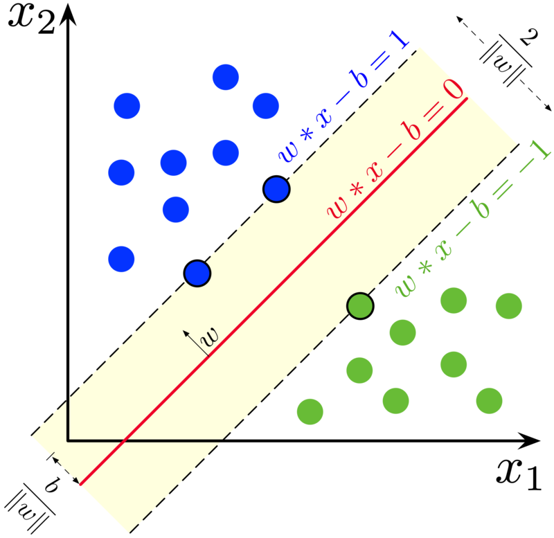

# *Support Vector Machines*



```diff
+ This is a Linear Model where Hyperplane is a line. 
+ Math will be different if we have to implement non linear model with different hyperplane where non linear kernel transformations like polynomial & RBF have to be used
```

# *Linear Model*

$w.x - b  = 0$\
$w.x_i - b \geq 1$ if $y_i =1$\
$w.x_i - b \leq 1$ if $y_i =-1$

*The equation to solve for optimization is:*

$y_i(w.x_i-b) \geq 1$

# *Cost Function*
## *Hinge Loss Function:*
$$L =  max(0,1-y_i(w.x_i - b))$$

$$J_i = min_w \space \lambda_i ||w||^2 + \frac{1}{n} \sum_{i=1} ^n max(0,1-y_i(w.x_i - b))$$

if $\space y_i .f(x) \geq 1:$

$$\space J_i = \lambda ||w||^2$$

else :

$$ J_i = \lambda ||w||^2 + 1- y_i(w.x_i-b)$$

# *Gradients*
if $\space y_i .f(x) \geq 1:$

$$\frac{dJ_i}{dw} = 2\lambda w$$

$$\frac{dJ_i}{db} = 0$$

else:

$$ \frac{dJ_i}{dw} = 2\lambda w - y_i.x_i$$
$$\frac{dJ_i}{db} = y_i$$

# *Update Rule*
$$b=b-\alpha .db$$ 
$$w=w-\alpha .dw$$
$.$

# *Steps to Perform to get Linear Support Vectors*

* Initialize weights and biases to zero (though random values might yield better results than zero).
* Compute weight and bias update as given in the above based on support vector condition.
* Maximize the margin of support vector by tweaking weight only with regularization $\lambda$, if sample is classified correctly.
* Else, tweak weights and bias to classify sample correctly and also to maximize margin.
* Iteraively, do this for n iterations (consider sufficient number of iterations for convergence)

### *This is not a perfect solution for SVM and code works only for 2d data and linear separation*
